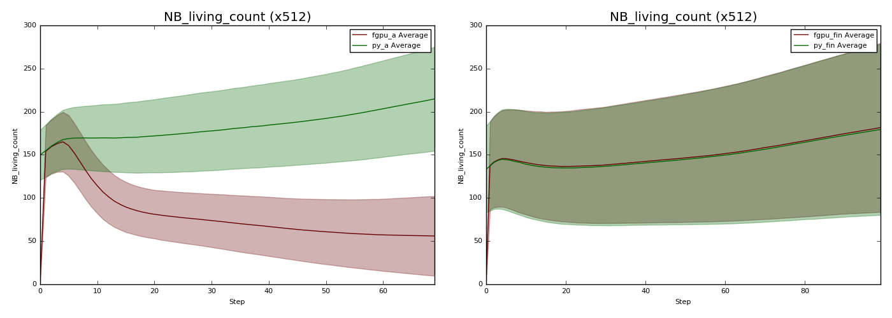
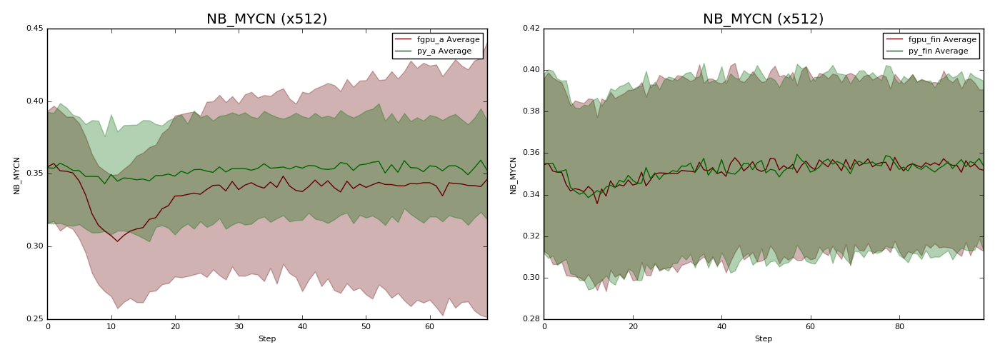
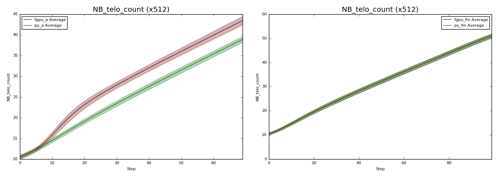
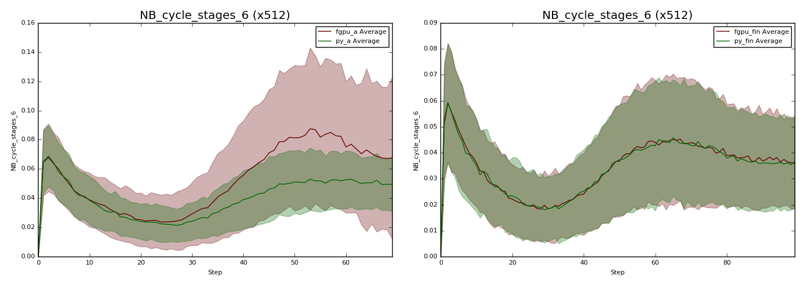

.. _DebuggingModelsLogging:

Logging Timeseries Data
=======================

:ref:`Logging<Configuring Data to be Logged>` can be used to collect timeseries data, such as how the size of agent populations change throughout a model's execution. Furthermore, with :ref:`ensembles<ensembles>` this data can be collected across a batch of runs, especially useful when dealing with stochastic models.

Use of logging in this manner is particularly useful when porting a pre-existing model to FLAME GPU 2, and is an approach we have used widely to validate our FLAME GPU 2 models behaviour matches.

1. Decide a model configuration which can be executed in both versions of the model
2. Execute both models many times, with a variety of different random seeds.
3. From these executions, collect timeseries data for a range of important model values. These might be population sizes, environment properties or the mean of agent variables.
4. Calculate the mean and standard deviation of each data point for both data sets and graph them.
5. The graph should contain two lines, if the models are operating the same they should match closely (this will also depend on the model's stochasticity and number of runs collected).
6. Presence of differences in some graphs before others can help narrow down the source of differences assisting in them being solved.

Below are some example before and after graphs, demonstrating how visible small bugs can be.

Both the Python and FLAME GPU models were executed with 512 different random seeds, for a low number of steps (60-80).

The number of agents is a major signal for the two models being equivalent.

  
  The average +- the standard deviation of the number of living NB cells at each time step.
  
When the number of agents is divergent, there will normally be multiple other agent variables which influence agent birth/death which diverge too.

  
  The average +- the standard deviation of the average of NB agent variable MYCN at each time step.

  
  The average +- the standard deviation of the average of NB agent variable telo_count at each time step.
  
Often times, awareness of the order in which such agent variables diverge will narrow the source of the problem sufficiently. However, in some cases even knowing the agent function at fault is not precise enough to spot a subtle mistake. At this point we suggest adding counters, :ref:`using environment macro properties<EnvironmentMacroPropertyCounters>`, to track how frequently different code-paths are followed, this can lead to identifying the specific condition at fault.

  
  The average +- the standard deviation of the proportion of NB agent's which passed the 6th branch within the cell cycle agent function.
  
From the above graphs, it should be clear how logging can enable the tracing of differences between two models. Longer runs can be useful, as the impact of differences grow with time, however the key to identifying tends to lie in spotting where/when they begin, or the period in which they reoccur. In this example, the Python model is not able to perform as the same scale as FLAME GPU, so runs used a small agent population of around 100 agents, for under 100 steps. The cells have a periodisation of 24 steps, so this is still sufficient, despite in practice this model executing with 100,000 or more agents for 3000+ steps.

.. _EnvironmentMacroPropertyCounters:

Environment Macro Property Counters
-----------------------------------

As mentioned in the previous example, it may be necessary to add counters to trace what proportion of agents are following each code-path.

For example, given the below simplified agent function:

.. tabs::

  .. code-tab:: cuda CUDA C++
  
    FLAMEGPU_AGENT_FUNCTION(NB_cell_cycle, flamegpu::MessageNone, flamegpu::MessageNone) {

        unsigned int s_cycle = FLAMEGPU->getVariable<unsigned int>("cycle");
        const int s_neighbours = FLAMEGPU->getVariable<int>("neighbours");
        const int s_MAPK_RAS = FLAMEGPU->getVariable<int>("MAPK_RAS");

        if (s_neighbours <= 3) {
            if (s_cycle < 12) {
                if (s_cycle == 0) {
                    if (FLAMEGPU->random.uniform<float>() < 0.5f) {
                        if (s_MAPK_RAS == 1) {
                            s_cycle += 1;
                        }
                    }
                } else if (s_MAPK_RAS == 1) {
                    s_cycle += 1;
                    if (s_cycle >= 12) {
                        s_cycle -= 1;
                    }
                }
            }
        }
        FLAMEGPU->setVariable<unsigned int>("cycle", s_cycle);
    }

It contains 9 ``if`` and ``else if`` statements, where agent's may diverge.

If we wish to explore how many agents take each path, first it's necessary to extend the model's definition.

.. tabs::

  .. code-tab:: cpp C++
    
    flamegpu::ModelDescription model("Counters Logging Example");
    
    ... // Existing model definition
    
    // New components for counting
    model.Environment().newMacroProperty<unsigned int, 9>("nb_cycle_counter");
    model.Environment().newProperty<unsigned int, 9>("nb_cycle_counter");
    
  .. code-tab:: py Python
    
    model = pyflamegpu.ModelDescription ("Counters Logging Example")
    
    ... # Existing model definition
    
    // New components for counting
    model.Environment().newMacroPropertyUInt("nb_cycle_counter", 9)
    model.Environment().newPropertyArrayFloat("nb_cycle_counter", 9)
    
A step function must also be added, to both copy the macro property to the environment property (to be logged), and to reset the macro property before the next step.

.. tabs::

  .. code-tab:: cpp C++
    
    FLAMEGPU_STEP_FUNCTION(reset_counters) {
        // Copy the data from macro environment property to environment property
        const float NB_COUNT = static_cast<float>(FLAMEGPU->agent("NB").count());  // Cast to avoid integer division
        auto nb_cycle_counter = FLAMEGPU->environment.getMacroProperty<unsigned int, 9>("nb_cycle_counter");
        for (unsigned int i = 0; i < 9; ++i) {
            // Normalise the data by dividing it by the number of agents
            FLAMEGPU->environment.setProperty<float, 9>("nb_cycle_counter", i, nb_cycle_counter[i] / NB_COUNT);
        }
        // Reset the macro environment property
        nb_cycle_counter.zero();
    }
    
    // Attach the step function to the model
    model.newStepFunction(reset_counters);
    
  .. code-tab:: py Python
    
    class reset_counters(pyflamegpu.HostFunctionCallback):
        def run(self,FLAMEGPU):
            # Copy the data from macro environment property to environment property
            NB_COUNT = FLAMEGPU.agent("NB").count()
            nb_cycle_counter = FLAMEGPU.environment.getMacroPropertyUInt("nb_cycle_counter")
            for i in range(9):
                FLAMEGPU.environment.setPropertyArrayFloat("nb_cycle_counter", i, nb_cycle_counter[i] / NB_COUNT)
            # Reset the macro environment property
            nb_cycle_counter.zero()
            
    // Attach the step function to the model
    model.addStepFunctionCallback(reset_counters().__disown__())

Now the agent function can be updated to increment the counters at each branch

.. tabs::

  .. code-tab:: cuda CUDA C++
  
    FLAMEGPU_AGENT_FUNCTION(NB_cell_cycle, flamegpu::MessageNone, flamegpu::MessageNone) {
        auto nb_cycle_counter = FLAMEGPU->environment.getMacroProperty<unsigned int, 9>("nb_cycle_counter");

        unsigned int s_cycle = FLAMEGPU->getVariable<unsigned int>("cycle");
        const int s_neighbours = FLAMEGPU->getVariable<int>("neighbours");
        const int s_MAPK_RAS = FLAMEGPU->getVariable<int>("MAPK_RAS");

        if (s_neighbours <= 3) {
            ++nb_cycle_counter[0];
            if (s_cycle < 12) {
                ++nb_cycle_counter[1];
                if (s_cycle == 0) {
                    ++nb_cycle_counter[2];
                    if (FLAMEGPU->random.uniform<float>() < 0.5f) {
                        ++nb_cycle_counter[3];
                        if (s_MAPK_RAS == 1) {
                            ++nb_cycle_counter[4];
                            s_cycle += 1;
                        }
                    }
                } else if (s_MAPK_RAS == 1) {
                    ++nb_cycle_counter[5];
                    s_cycle += 1;
                    if (s_cycle >= 12) {
                        ++nb_cycle_counter[6];
                        s_cycle -= 1;
                    }
                }
            }
        }
        FLAMEGPU->setVariable<unsigned int>("cycle", s_cycle);
    }
    
With all this setup, the environment property ``nb_cycle_counter`` will contain the proportion of agents which took each branch at the end of every step. This value can be logged and graphed to compare with other implementations.

Related Links
-------------
* User Guide: :ref:`Configuring Data to be Logged<Configuring Data to be Logged>`
* User Guide: :ref:`Defining Environment Macro Properties<Define Macro Environmental Properties>`