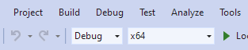
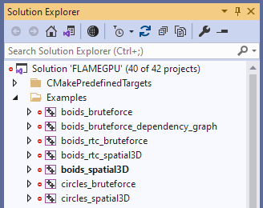
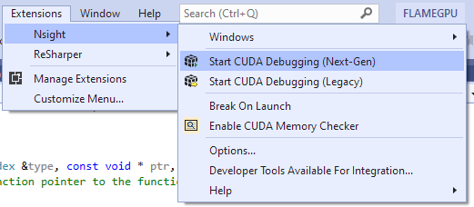
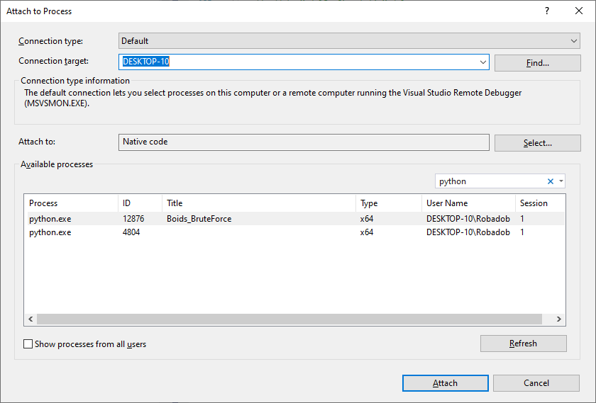

.. _UsingADebugger:

Using a Debugger
================

FLAME GPU 2 models are executed using highly parallel GPU code, this often makes use of traditional debugging tools significantly more challenging. As such, if you are unfamiliar with using debuggers you may by attempting the techniques outlined in the preceding sections first.

Debugging FLAME GPU 2 models follows a fairly standard approach to CUDA debugging. However, the approaches differ slightly dependent on your operating system (Windows/Linux) and whether you are using the C++ or Python API. This section details how to attach your model to a debugger, the user-guide for specified debuggers should be referred to for details on using the debugger.

In order to debug your model, it is necessary to produce a debug build or use a debug build of pyflamegpu. This removes optimisations, and can lead to performance prohibitively slow for large models.

.. note::

    It is not currently possible to debug :ref:`Python agent functions<Python Agent Functions>` using either Windows or Linux. Furthermore, we were unable to attach the Windows CUDA debugger to :ref:`RTC agent functions<Runtime Compiled Agent Functions>`.

Windows
-------

On Windows `Nsight Visual Studio Edition <https://docs.nvidia.com/nsight-visual-studio-edition/cuda-debugger>`__ is used to debug CUDA projects. This installs as a Visual Studio extension, when installing CUDA (with Visual Studio pre-installed), and provides a graphical interface to debugging.

C++
~~~

In order to produce a debug capable build, it is necessary to ensure the active build configuration is set to ``Debug`` (or ``RelWithDebInfo``) and ``x64``, prior to compilation, as shown in the image below.

Next, ensure your model is shown is the current startup project. The easiest way to check this, is check whether it's name appears bold within the Solution Explorer (shown for boids_spatial3D in the below image). If this is not the case, it can be right-clicked and the option "Set as Startup Project" used from the context menu.

  
Now if your model has been built, you can launch it with NSight debugger, via the ``Extensions > Nsight`` menu.

Currently Nsight has two different debuggers, "Next-Gen" and "Legacy". Whilst they use much the same debugging GUI, they have some key differences.

The legacy debugger only supports the GPU architectures earlier than Pascal (Compute Capability < 60), such as Kepler and Maxwell GPUs. Additionally the legacy debugger can only debug GPU code in isolation, the normal Visual Studio debugger must be used to debug host code separately.

The next-gen debugger only supports the GPU architectures Pascal and later(Compute Capability >= 60) and can debug GPU and CPU code simultaneously, however this can lead to challenges when placing breakpoints in files containing both CPU and GPU sources. Additionally the next-gen debugger does not have integrated support for the CUDA memory checker, instead the standalone tool `Compute Sanitizer <https://docs.nvidia.com/compute-sanitizer/ComputeSanitizer/index.html>`__ (which installs alongside CUDA) must be used.

.. note::

  Launching Nsight does not force build your project when it is out of date, unlike the regular Visual Studio debugger. If you have updated your code, you must build it again manually before restarting either Nsight debugger.

Python
~~~~~~

Based on our testing, it is not currently possible to debug Python's runtime compiled agent functions on Windows, all attempts to break during execution of agent functions failed.

It is however possible to attach visual studio's host-code debugger to the executing Python process and breakpoint into the main FLAME GPU library's code.

First, it is necessary to be using a debug build of pyflamegpu. It is recommended that you compile this yourself, as you will require the full Visual Studio project in order to use the debugger effectively. Ensure debug is selected as the configuration before you begin compilation.

  
Next, begin executing your code (in a Python environment with the debug copy of pyflamegpu). You may wish to add a call to Python's ``input()``, to halt execution.

Once your code is executing, you can open the attach to process dialogue, via the ``Debug > Attach to Process...`` menu.

From here, you may need to select to attach to "Native code" (Nsight options are also available, however we were unable to get them to work).

Finally, you can search for Python processes. If your code is executing a visualisation, the window's title will be listed making it easy to identify the correct thread. Otherwise it may require some trial and error.

After attaching to the process, you can create breakpoints within the host code of the flame gpu library which will halt when execution reaches them. Likewise, this should provide additional information in the case an exception is thrown.

Linux
-----

On Linux `CUDA-GDB <https://docs.nvidia.com/cuda/cuda-gdb/index.html>`__ is used to debug CUDA projects. This installs alongside CUDA on Linux, and is an extended version of the command-line debugger `GDB <https://sourceware.org/gdb/current/onlinedocs/gdb/>`__.

`Nsight Visual Studio Code <https://developer.nvidia.com/nsight-visual-studio-code-edition>`__ can be used as a graphical frontend for ``cuda-gdb``.

C++
~~~

In order to produce a debug build, it is necessary to specify ``-DCMAKE_BUILD_TYPE=Debug`` (or ``Debug`` can be replaced with ``RelWithDebInfo``) when configuring CMake. When compiled this should produce a binary in the ``build/bin/Debug`` directory.

This can then be launched with ``cuda-gdb``, e.g. ``cuda-gdb --args my_model -s 10 -r 12``.

From here follows the normal ``cuda-gdb`` workflow, such as ``start`` (start the program executing), ``break <location>`` (specify a breakpoint using either ``<file>:<line>`` or ``<file>:<method>``, for example ``main.cu:86`` or ``main.cu:begin``), ``continue`` (continue from the implicit breakpoint at entry), ``backtrace`` (produce a stack trace after the debugger halts for a breakpoint or exception). Refer to the full `CUDA-GDB <https://docs.nvidia.com/cuda/cuda-gdb/index.html>`__  and `GDB <https://sourceware.org/gdb/current/onlinedocs/gdb/>`__ guides for more detailed instructions.

Python
~~~~~~
In order to produce a debug build of pyflamegpu, it is necessary to specify ``-DCMAKE_BUILD_TYPE=Debug`` when configuring CMake. Additionally, you should pass ``-DEXPORT_RTC_SOURCES=ON``. When compiled this should produce a binary in the ``build/bin/Debug`` directory, and the compiled RTC sources will be exported to the working directory at runtime.

.. note::

  The dynamic RTC curve header generated for each agent function shares the same name ``curve_rtc_dynamic.h``, but they will be exported with the name ``<agent function>_curve_rtc_dynamic.h``. The debugger is not able to differentiate between the different rtc headers for breakpointing etc.
  
You can now debug your pyflamegpu model with a fairly normal ``cuda-gdb`` workflow.

For example:

.. tabs::

  .. code-tab:: bash Linux Bash/CUDA-GDB

       # Activate pyflamegpu virtual env
       source build/lib/Debug/python/venv/bin/activate
       # Navigate to model
       cd examples/swig_boids_spatial3D
       # Launch CUDA-GDB
       cuda-gdb --args python boids_spatial3D.py -s 100 --verbose
       # Start debugging (it will halt at entry to the program)
       start
       # Attach a breakpoint to an agent function
       break outputdata_impl.cu:4 # Note that this is the agent function source exported by pyflamegpu
       # Make breakpoint pending on future shared library load? (y or [n])
       y
       # Attach a breakpoint to the core flamegpu library
       break CUDASimulation.cu:simulate()
       # Make breakpoint pending on future shared library load? (y or [n])
       y
       # Continue from the initial breakpoint
       cont
       # CUDA-GDB will now trap when it reaches one of the breakpoints you specified or an exception is thrown
       

Related Links
-------------
* User Guide Page: :ref:`Building From Source<q-compiling flamegpu>` (C++)
* User Guide Page: :ref:`Building From Source<q-python-building-from-source>` (Python)
* `Compute Sanitizer Manual <https://docs.nvidia.com/compute-sanitizer/ComputeSanitizer/index.html>`__ (CUDA MemCheck Tool)
* `Nsight Visual Studio Edition Manual <https://docs.nvidia.com/nsight-visual-studio-edition/cuda-debugger>`__ (Windows CUDA Debugger)
* `CUDA-GDB Manual <https://docs.nvidia.com/cuda/cuda-gdb/index.html>`__ (Linux CUDA Debugger)
* `GDB Manual <https://sourceware.org/gdb/current/onlinedocs/gdb/>`__ (Linux Debugger)