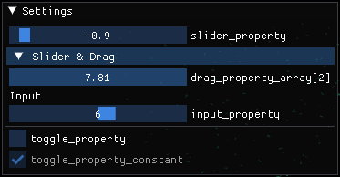
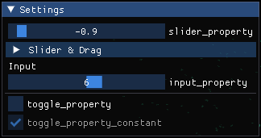

Visualising Additional Details
==============================

In addition to visualising agents, you may wish to visualise the environment bounding box, or environment properties.

User Interface (Environment Properties)
---------------------------------------

FLAME GPU visualisations can be extended by adding one or more user-interface panels using :func:`newUIPanel()<flamegpu::visualiser::ModelVis::newUIPanel>`. This returns a :class:`PanelVis<flamegpu::visualiser::PanelVis>` which can be used to customise a user-interface allowing users to see and interactively update environment properties during a simulation's execution.

Environment properties marked as constant within the model, cannot be updated via UIs and will instead appear disabled.

.. tabs::

  .. code-tab:: cpp C++

    // Configure the visualisation
    flamegpu::visualiser::ModelVis &m_vis = cudaSimulation.getVisualisation();
    // Create a new UI panel named "Settings
    flamegpu::visualiser::PanelVis ui = m_vis.newUIPanel("Settings");
    // Create a named collapsible section "Sliders"
    ui.newSection("Slider & Drag");
    // Add an environment property slider with the inclusive range [-1.0, 1.0]
    ui.newEnvironmentPropertySlider<float>("slider_property", -1.0f, 1.0f);
    # Add an environment property array element drag_property_array[2] drag with the inclusive range [0.0, 10.0]
    ui.newEnvironmentPropertyDrag<float>("drag_property_array", 2, 0.0, 10.0, 0.1);
    // End the collapsible section
    ui.newEndSection();
    // Add a static text label
    ui.newStaticLabel("Input");
    // Add an environment property input with step speeds 1 & 10
    ui.newEnvironmentPropertySlider<int>("input_property", 1, 10);
    // Add a horizontal separator
    ui.newSeparator();
    // Add an environment property checkbox
    ui.newEnvironmentPropertyToggle<int>("toggle_property");
    // Add an environment property checkbox, for a constant property
    ui.newEnvironmentPropertyToggle<int>("toggle_property_constant");
    
  .. code-tab:: py Python

    # Configure the visualisation
    m_vis = cudaSimulation.getVisualisation();
    # Create a new UI panel named "Settings
    ui = m_vis.newUIPanel("Settings")
    # Create a named collapsible section "Sliders"
    ui.newSection("Slider & Drag")
    # Add an environment property slider with the inclusive range [-1.0, 1.0]
    ui.newEnvironmentPropertySliderFloat("slider_property", -1.0, 1.0)
    # Add an environment property array element drag_property_array[2] drag with the inclusive range [0.0, 10.0]
    ui.newEnvironmentPropertyDragFloat("drag_property_array", 2, 0.0, 10.0, 0.1)
    # End the collapsible section
    ui.newEndSection();
    # Add a static text label
    ui.newStaticLabel("Input")
    # Add an environment property input with step speeds 1 & 10
    ui.newEnvironmentPropertySliderInt("input_property", 1, 10)
    # Add a horizontal separator
    ui.newSeparator()
    # Add an environment property checkbox
    ui.newEnvironmentPropertyToggleInt("toggle_property")
    # Add an environment property checkbox, for a constant property
    ui.newEnvironmentPropertyToggleInt("toggle_property_constant")
    
The below image demonstrates how the above interface appears during a visualisation, with the collapsible section open (left) and collapsed (right).

  

  
  
.. note::

  It is not possible to add multiple inputs for the same environment property or environment array property element to the same panel.

Lines
-----

FLAME GPU visualisations allow you to define static line drawings, from either line segments or a single polyline as part of the visualisation config using :func:`newLineSketch()<flamegpu::visualiser::ModelVis::newLineSketch>` and :func:`newPolylineSketch()<flamegpu::visualiser::ModelVis::newPolylineSketch>`. Both methods return a :class:`LineVis<flamegpu::visualiser::LineVis>` which can be used to specify the vertices of the lines to be rendered.

These can be useful to denote the bounding area of the environment, or other details.

.. tabs::

  .. code-tab:: cpp C++

    // Configure the visualisation
    flamegpu::visualiser::ModelVis &m_vis = cudaSimulation.getVisualisation();
    // Draw a square out of line segments, white 20% alpha
    flamegpu::visualiser::LineVis pen = m_vis.newLineSketch(1.0f, 1.0f, 1.0f, 0.2f);
    pen.addVertex(0.0f, 0.0f, 0.0f); pen.addVertex(1.0f, 0.0f, 0.0f);
    pen.addVertex(1.0f, 0.0f, 0.0f); pen.addVertex(1.0f, 0.0f, 1.0f);
    pen.addVertex(1.0f, 0.0f, 1.0f); pen.addVertex(0.0f, 0.0f, 1.0f);
    pen.addVertex(0.0f, 0.0f, 1.0f); pen.addVertex(0.0f, 0.0f, 0.0f);
    // Or, draw a square out of a single poly-line, red 50% alpha
    flamegpu::visualiser::LineVis pen2 = m_vis.newPolylineSketch(1.0f, 0.0f, 0.0f, 0.5f);
    pen.addVertex(0.0f, 0.0f, 0.0f);
    pen.addVertex(1.0f, 0.0f, 0.0f);
    pen.addVertex(1.0f, 0.0f, 1.0f);
    pen.addVertex(0.0f, 0.0f, 1.0f);
    pen.addVertex(0.0f, 0.0f, 0.0f);
    
  .. code-tab:: py Python

    # Configure the visualisation
    m_vis = cudaSimulation.getVisualisation();
    # Draw a square out of line segments, white 20% alpha
    pen = m_vis.newLineSketch(1.0, 1.0, 1.0, 0.2);
    pen.addVertex(0.0, 0.0, 0.0); pen.addVertex(1.0, 0.0, 0.0);
    pen.addVertex(1.0, 0.0, 0.0); pen.addVertex(1.0, 0.0, 1.0);
    pen.addVertex(1.0, 0.0, 1.0); pen.addVertex(0.0, 0.0, 1.0);
    pen.addVertex(0.0, 0.0, 1.0); pen.addVertex(0.0, 0.0, 0.0);
    # Or, draw a square out of a single polyline, red 50% alpha
    pen2 = m_vis.newPolylineSketch(1.0, 0.0, 0.0, 0.5);
    pen.addVertex(0.0, 0.0, 0.0);
    pen.addVertex(1.0, 0.0, 0.0);
    pen.addVertex(1.0, 0.0, 1.0);
    pen.addVertex(0.0, 0.0, 1.0);
    pen.addVertex(0.0, 0.0, 0.0);

It is not currently possible to update these line drawings during a model's execution, however we may add support for this in future.

Models
------
If your environment is instead represented by a 3D model, it is possible to load it into the visualisation using :func:`addStaticModel()<flamegpu::visualiser::ModelVis::addStaticModel>` which returns a :class:`StaticModelVis<flamegpu::visualiser::StaticModelVis>`.  
This can then be used to specify the model's location scale and rotation as required.

Like the models representing agents, currently only the ``.obj`` (wavefront) format is supported.

.. tabs::

  .. code-tab:: cpp C++

    // Configure the visualisation
    flamegpu::visualiser::ModelVis &m_vis = cudaSimulation.getVisualisation();
    // Add the environment's model
    flamegpu::visualiser::StaticModelVis env_model = m_vis.addStaticModel("myfiles/town.obj");
    // Configure the model
    env_model.setModelScale(10.0f, 5.0f, 1.0f);
    env_model.setModelLocation(0.0f, -5.0f, 0.0f);
    env_model.setModelRotation(0.0f, 1.0f, 0.0f, 3.141/2.0f);
    
  .. code-tab:: py Python

    # Configure the visualisation
    m_vis = cudaSimulation.getVisualisation();
    # Add the environment's model
    env_model = m_vis.addStaticModel("myfiles/town.obj");
    # Configure the model
    env_model.setModelScale(10.0f, 5.0f, 1.0f);
    env_model.setModelLocation(0.0f, -5.0f, 0.0f);
    env_model.setModelRotation(0.0f, 1.0f, 0.0f, 3.141/2.0f);
    
    
Related Links
-------------

* Full API documentation for :class:`ModelVis<flamegpu::visualiser::ModelVis>`
* Full API documentation for :class:`PanelVis<flamegpu::visualiser::PanelVis>`
* Full API documentation for :class:`LineVis<flamegpu::visualiser::LineVis>`
* Full API documentation for :class:`StaticModelVis<flamegpu::StaticModelVis>`