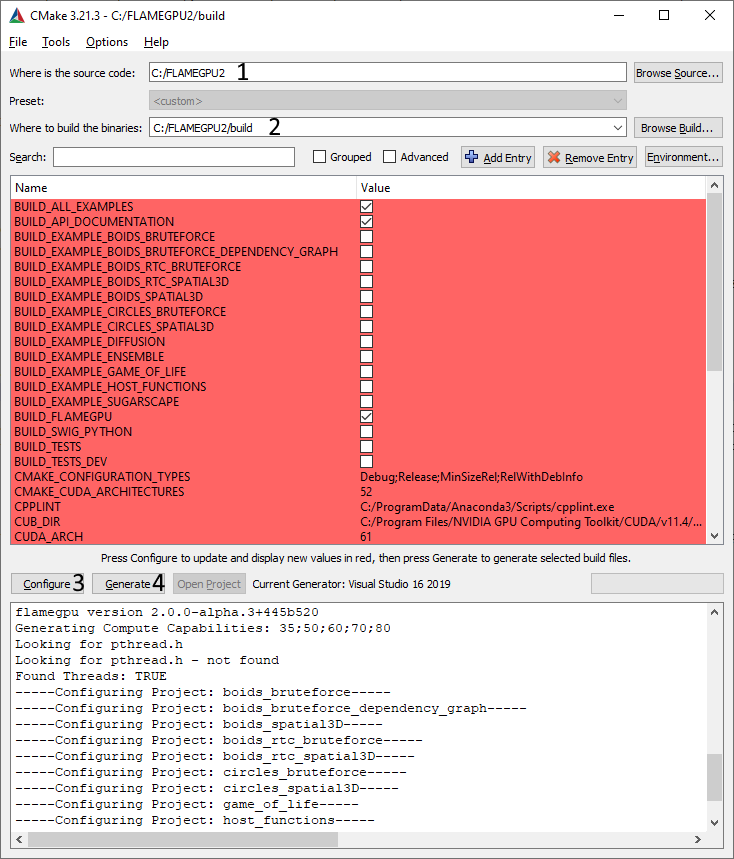
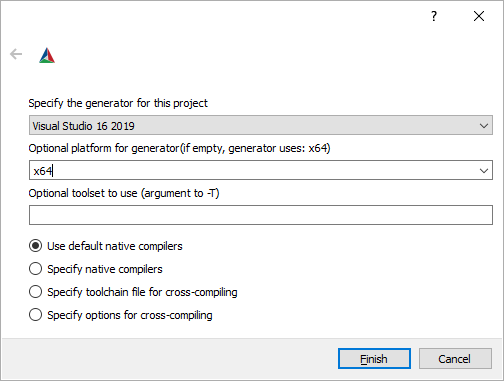

.. _quickstart:

Quickstart
==========

This document lists the minimal steps to install or build FLAME GPU 2, create a new model and run a simulation.

Details are provided for both the :ref:`C++ <q-cudacpp-quickstart>` and :ref:`Python 3 <q-python-quickstart>` interfaces, however first you should review the following prerequisites section.

.. _quickstart-prerequisites:

Prerequisites
-------------

Regardless of which programming interface you wish to use there are some common requirements:

* Windows or Linux (with glibc ``>= 2.17``)
* `CUDA Toolkit <https://developer.nvidia.com/cuda-downloads>`__ >= 11.0 and a `Compute Capability <https://developer.nvidia.com/cuda-downloads>`__ >= 3.5 NVIDIA GPU

Installing python binary wheels requires:

* `Python <https://www.python.org/>`__ ``>= 3.6``

   * ``pip``

Building C++ from source: 

* `git <https://git-scm.com/>`__
* `CMake <https://cmake.org/download/>`__ ``>= 3.18``
* C++17 capable C++ compiler (host), compatible with the installed CUDA version

  * `Microsoft Visual Studio 2019 <https://visualstudio.microsoft.com/>`__ (Windows)
  * `make <https://www.gnu.org/software/make/>`__ and `GCC <https://gcc.gnu.org/>`__ `>= 7` (Linux)

If you wish to build python bindings from source you will also require:

* `swig <http://www.swig.org/>`__ ``>= 4.0.2``
  
  * Swig ``4.x`` will be automatically downloaded by CMake if not available (if possible)

.. _q-cudacpp-quickstart:

C++
---

Installation
^^^^^^^^^^^^

The C++ interface is not currently available as a pre-built binary distribution, or configured for central installation at this time. 

Please refer to :ref:`q-building-from-source-cudacpp` section.

.. _q-building-from-source-cudacpp:

Creating a New Project
^^^^^^^^^^^^^^^^^^^^^^

The simplest way to create a new project is to use the provided template repository on GitHub: 

https://github.com/FLAMEGPU/FLAMEGPU2-example-template

This includes a ``CMakeLists.txt`` file, which sets a binary target named ``example``, which depends on the core ``FLAMEGPU/FLAMEGPU2`` repository, and will build it from source if required.

You can either:

* Use GitHubs's ``Use this template`` feature to create a copy of the template repository on your account
* Download a copy of the template repository as a zip via ``Download zip``
* Clone the template repository via ``git clone git@github.com:FLAMEGPU/FLAMEGPU2-example-template.git``

See the template project's ``README.md`` for more information related to using and customising this template.

.. _q-compiling flamegpu:

Compiling Your Project
^^^^^^^^^^^^^^^^^^^^^^

FLAME GPU 2 projects using the C++ interface use CMake with out-of-source builds. This is a 3 step process:

1. Create a build directory for an out of tree build
2. Configure CMake into the build directory, using the CMake CLI or GUI
   
   * Customise any CMake configuration options, such as the CUDA compute capabilities to target

3. Build compilation targets using the configured build system

For example, to build the ``example`` target of the template repository, for Compute Capability 6.0 GPUs in the Release configuration, using 8 threads:

.. tabs::

  .. code-tab:: bash Linux

       mkdir -p build && cd build
       cmake .. -DCUDA_ARCH=61 -DCMAKE_BUILD_TYPE=Release
       cmake --build . --target example -j 8
       
  .. code-tab:: bat Windows

     mkdir build && cd build
     cmake .. -A x64 -G "Visual Studio 16 2019" -DCUDA_ARCH=61
     cmake --build . --target example --config Release -j 8

For more information on CMake Configuration options please see the `template repository README.md <https://github.com/FLAMEGPU/FLAMEGPU2-example-template#building-with-cmake>`__ as these options may vary between releases.

CMake GUI (Windows Only)
~~~~~~~~~~~~~~~~~~~~~~~~

However, CMake also provides ``cmake-gui`` on Windows, a CMake client with a graphical interface which may be preferable. 

  
* Specify the directory containing the FLAME GPU 2 source (**Annotation #1**). This should be the directory you cloned the git repository into.
* Specify the directory to store FLAME GPU 2 build files (**Annotation #2**). This must not match the source directory FLAME GPU 2 does not currently support in-source builds. The ``build`` subdirectory of the source directory is most commonly used. If this directory does not exist, CMake will offer to create it for you.
* Press the Configure button (**Annotation #3**) to load the configuration options. You will then be asked to select a 'generator' (see the below image), you should select the latest version of visual studio you have and choose the ``x64`` platform. It will then perform various checks to initialise the build configuration, such as detecting CUDA and testing the compiler is suitable.
* The central table should now be filled with options you can configure to adjust how FLAME GPU 2 is built. You can update these options, according to the `FLAME GPU 2 README.md <https://github.com/FLAMEGPU/FLAMEGPU2/#cmake-configuration-options>`__ in the source directory as suggested options may vary between releases.
* If you have changed any options, you should press the Configure button again (**Annotation #3**), as subsequent initialisation may need to be performed.
* After the configuration options have been selected and applied, the project can be generated using the Generate button (**Annotation #4**).
* If generation succeeds the Open Project button should now be available. Clicking this should open the project in Visual Studio so that you can build FLAME GPU 2. If you have multiple versions of Visual Studio installed, it may open with the wrong version. You can alternatively, locate the ``.vcxproj`` and ``.sln`` files in the build directory you specified (**Annotation #2**), a project file is created for each sub-component and example, opening ``ALL_BUILD.vcxproj`` will open the full solution with all configured components.

   
Running Your Project
^^^^^^^^^^^^^^^^^^^^

Once compiled, the executable will be placed into the ``bin/<config>/`` directory within your build directory. Execute with ``--help`` for :ref:`CLI argument information<Configuring Execution>`.

.. tabs::
  .. code-tab:: bash Linux

     cd build
     ./bin/Release/example --help
     
  .. code-tab:: bat Windows

     cd build
     "bin/Release/example" --help

.. _q-python-quickstart:

Python 3
--------

The Python 3 interface for FLAME GPU 2 is available via pre-compiled binary wheels for some platforms, or can be built from source via CMake. 

.. _q-python_installation:

Installation
^^^^^^^^^^^^

Pre-built binary wheels are available for Windows and Linux on x86_64 platforms for:

* Python ``3.6`` to Python ``3.9``
* ``CUDA 11.0`` or ``CUDA 11.2+`` installations
* CUDA Compute Capability ``>= 3.5`` GPUs.
* With and without Visualisation support

If you do not meet these requirements, please see :ref:`q-python-building-from-source`.

To install the binary wheel for your combination of software requirements:

* Download the appropriate python wheel from the `latest GitHub Release <https://github.com/FLAMEGPU/FLAMEGPU2/releases/latest>`__
  
  * See the release notes of the specific release for details of which file corresponds to which release

* Optionally create a new python ``venv`` or conda environment to install the ``.whl`` in to

.. tabs::
  .. code-tab:: bash Linux

     # If using a python venv:
     python3 -m venv venv
     source venv/bin/activate/bash
     
  .. code-tab:: bat Windows

     :: If using a python venv
     python -m venv venv
     call "venv/Scripts/activate.bat"

* Install the downloaded ``.whl`` file into your python environment via pip

.. tabs::
  .. code-tab:: bash Linux

     python3 -m pip install filename.whl
     
  .. code-tab:: bat Windows

     python -m pip install filename.whl

.. _q-python-building-from-source:

Building From Source
^^^^^^^^^^^^^^^^^^^^

FLAME GPU 2 uses CMake with out-of-source builds. This is a 3 step process:

1. Create a build directory for an out of tree build
2. Configure CMake into the build directory, using the CMake CLI or GUI
   
   * Specify CMake configuration options such as the compute capabilities to target at this stage

3. Build compilation targets using the configured build system

To build the python bindings, the ``BUILD_SWIG_PYTHON`` CMake option must be set to ``ON``, and the ``pyflamegpu`` target must be compiled. The generated python binary wheel can then be installed into your python environment of choice via `pip`

For example, to build and install python bindings into a new venv, for Compute Capability 6.0 GPUs in the Release configuration, using 8 threads:

.. tabs::
  .. code-tab:: bash Linux

       # Create and activate your venv
       python3 -m venv venv
       source venv/bin/activate

       # Build the python bindings, producing a .whl
       mkdir -p build && cd build
       cmake .. -DCUDA_ARCH=61 -DBUILD_SWIG_PYTHON=ON -DCMAKE_BUILD_TYPE=Release
       cmake --build . --target pyflamegpu -j 8

       # Install the wheel via pip
       python3 -m pip install lib/Release/python/venv/dist/*.whl
     
  .. code-tab:: bat Windows

       :: Create and activate your venv
       python -m venv venv
       call "venv/Scripts/activate.bat"

       :: Build the python bindings, producing a .whl
       mkdir build && cd build
       cmake .. -A x64 -G "Visual Studio 16 2019" -DCUDA_ARCH=61 -DBUILD_SWIG_PYTHON=ON
       cmake --build . --target pyflamegpu --config Release -j 8

       :: Install the wheel via pip
       python -m pip install lib/Release/python/venv/dist/*.whl

Creating a New Project
^^^^^^^^^^^^^^^^^^^^^^

The simplest way to create a new project is to use the provide template repository on GitHub: 

https://github.com/FLAMEGPU/FLAMEGPU2-python-example-template

You can either:

* Use GitHubs's ``Use this template`` feature to create a copy of the template repository on your account
* Download a copy of the template repository as a zip via ``Download zip``
* Clone the template repository via 
  
  .. code-block:: bash

     git clone git@github.com:FLAMEGPU/FLAMEGPU2-python-example-template.git

Alternatively, as python models do not require a complex build system such as CMake simply creating a new python source file which includes ``import pyflamegpu`` would be sufficient.

Then edit the python file as desired.

Running your project
^^^^^^^^^^^^^^^^^^^^

To run your python-based model:

* Activate the python environment which has ``pyflamegpu`` installed

.. tabs::
  .. code-tab:: bash Linux

      # Assuming a python venv was created in the current directory, named venv
      source venv/bin/bash/activate
     
  .. code-tab:: bat Windows

      :: Assuming a python venv was created in the current directory, named venv
      call "venv/Scripts/activate.bat"

* Run your models ``.py`` file using your python 3 interpreter

.. tabs::
  .. code-tab:: bash Linux

      # Assuming the main python file for your model is called model.py
      # Use --help for Usage instructions
      python3 model.py --help
     
  .. code-tab:: bat Windows

      :: Assuming the main python file for your model is called model.py
      :: Use --help for Usage instructions
      python model.py --help
